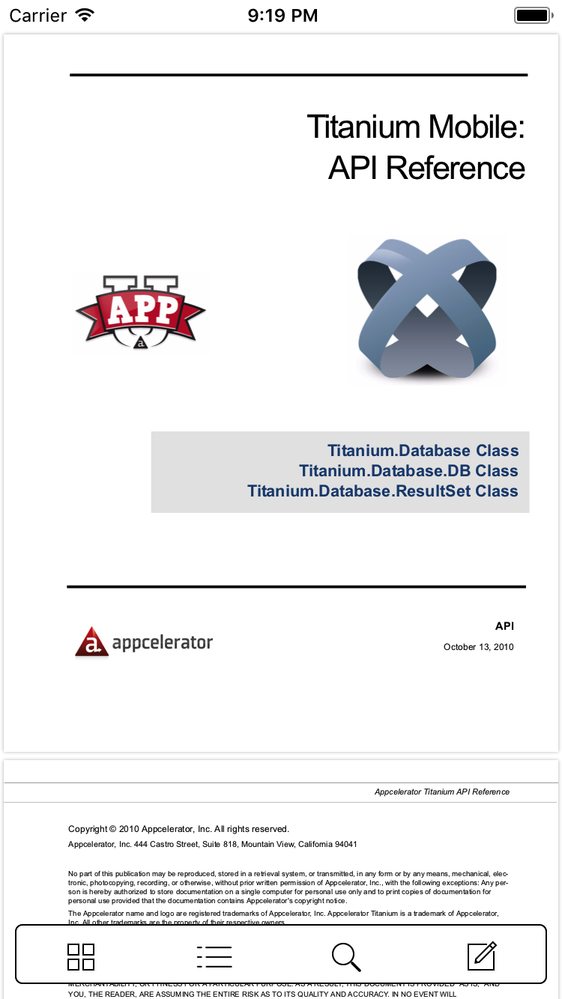
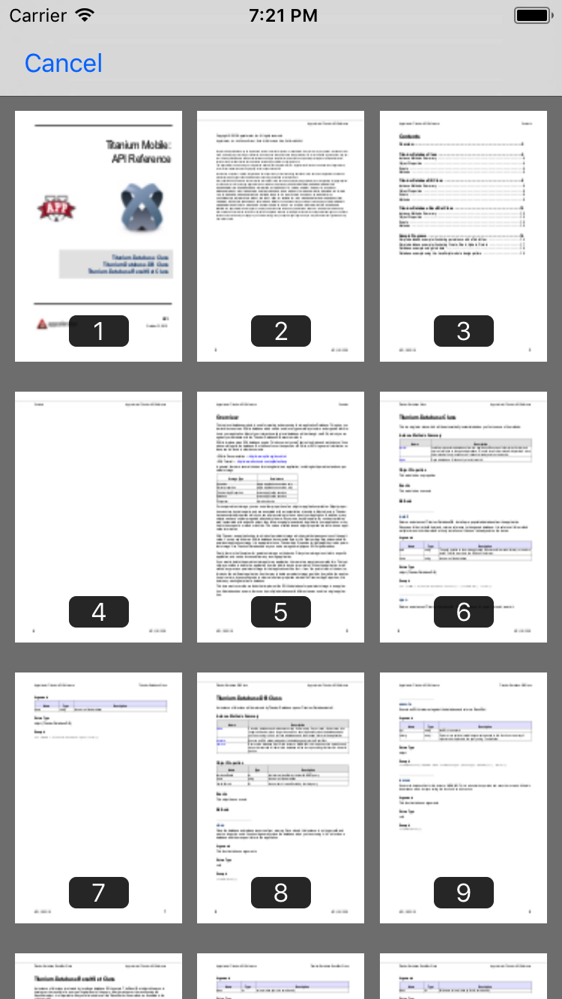
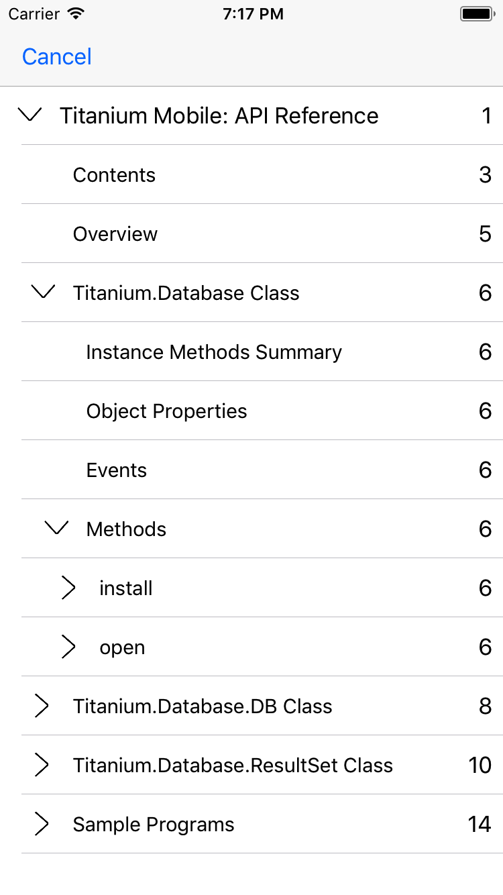
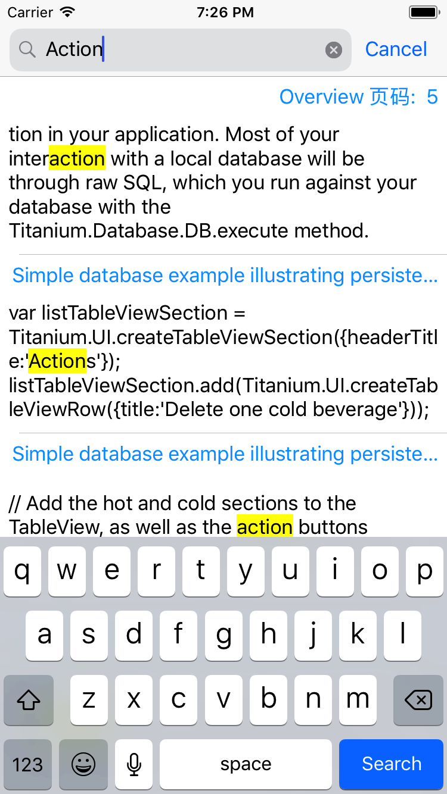

# iOS11-PDFKit-Example

  

Code example for PDFKit on iOS 11.

**Note**: The project requires Xcode 9 Beta 1 or later, Swift 4 and iOS 11.

## Contents

### [PDFKit](https://developer.apple.com/documentation/pdfkit)

## Author

ytlan0201@gmail.com

## License

MIT